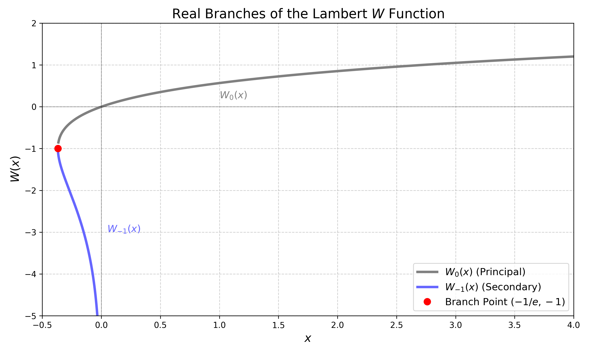

If you have ever tried to solve an equation where the variable appears both in the base and the exponent, like $x e^x = y$, you have likely hit a wall using standard elementary functions. Enter the LambertW function. While it might not be as famous as the logarithm or the exponential, it is a powerhouse tool in modern applied mathematics, appearing in everything from network modelling to statistical inference.

## What is the LambertW Function?

Simply put, the LambertW function is the multivalued inverse of the function:

$$f(w) = w e^w$$

for any complex number $w$.

If we have an equation of the form $z = w e^w$, the solution for $w$ is given by:

$$w = \operatorname{W}_k(z)$$

where $k$ indicates the "branch" of the solution. Just as the complex logarithm $\log z$ has infinitely many values differing by $2\pi i$, the LambertW function has countably many branches because the mapping $w \mapsto w e^w$ is not injective.

## A Brief History

The function is named after the polymath Johann Heinrich Lambert (1728-1777). Lambert is famous for the first proof of the irrationality of $\pi$ and for the Beer-Lambert law in optics. In 1758, he solved a related trinomial equation [[Lambert1758]](#lambert1758), which led Leonhard Euler to describe the properties of what we now call the $W$ function in 1783 [[Euler1783]](#euler1783).

The notation $W$ and the standardization of the function were only solidified much later, in a 1996 paper by Corless, Gonnet, Hare, Jeffrey, and Knuth [[Corless1996]](#corless1996).

## The Complex Landscape

In complex analysis, a branch of a multivalued function is a single-valued function that is analytic in a specific domain. For the LambertW, these branches are defined by partitioning the codomain (the $w$-plane) into disjoint regions $\Omega_k$. Each region is mapped bijectively to the $z$-plane minus a specific set of points called the branch cut.

**The Partition of the $w$-plane**

We represents here the $w$-plane (the domain of $f(w) = w e^w$). The colored regions are the fundamental regions $\Omega_k$. By definition, the $k$-th branch of the Lambert $W$ function is the inverse of the restriction of $f$ to $\Omega_k$.

$$W_k : \mathbb{C} \setminus \text{Cut} \to \Omega_k$$

The identity $W_k(z e^z) = z$ is satisfied if and only if $z$ lies in the region $\Omega_k$.


<figure>
  
<figcaption>Figure 1: Branches of the LambertW.</figcaption>
</figure>

**Critical Points and Branch Points:**

The derivative $f'(w) = (w+1)e^w$ vanishes at a single point $w = -1$, with critical value $z = f(-1) = -1/e$. Consequently, the inverse function $W(z)$ has a simple algebraic branch point of order 2 at $z = -1/e$. This singularity governs the connection between the principal branch $W_0$ and the branch $W_{-1}$.

**Branch Cuts and Analyticity:**

Following the standard convention ([Corless1996](#corless1996)), the branches are defined by specific cuts in the complex $z$-plane:

- $W_0(z)$ (Principal Branch): Analytic at $0$ with $W_0(0)=0$. The branch cut lies along the negative real axis $(-\infty, -1/e]$. Its range is the region of the $w$-plane containing the real interval $(-1, \infty)$ and bounded by the transcendental curve satisfying $|w e^w| = |-1/e|$ (roughly $|\operatorname{Im}(w)| < \pi$).

- $W_{-1}(z)$: Shares the branch cut $(-\infty, -1/e]$ with $W_0$. Its values satisfy $W_{-1}(z) \leq -1$ for real $z \in (-1/e, 0)$.

- $W_k(z)$ for $k \notin \{0, -1\}$: These branches have a cut along the entire negative real axis $(-\infty, 0]$. They map to regions in the $w$-plane roughly corresponding to strips $2k\pi < \operatorname{Im}(w) < 2(k+1)\pi$.


## Restriction to the real

In most cases of interest in statistics and machine learning, we are only interested in the restriction of the Lambert $W$ function to $\mathbb{R}$. From our illustration, we can observe that only two branches can produce real solutions: $W_0$ and $W_{-1}$. This is because these are the only regions that intersect the real axis of the $w$-plane.

We can define these real branches by looking at the reciprocal images under the forward map $f(w) = we^w$:

$$W_0^{-1}([-1,+\infty]) \cap \mathbb{R} =f([-1,+\infty])=[-1/e,+\infty]$$
$$W_{-1}^{-1}([-\infty,-1]) \cap \mathbb{R} =f([-\infty,-1])=[-1/e,0]$$

This leads to the following description of the real Lambert $W$ branches:

**The Principal Branch ($W_0$):**

Defined for $x \geq -1/e$.

The output satisfies $W_0(x) \geq -1$.


**The Secondary Branch ($W_{-1}$):**

Defined for $-1/e \leq x < 0$.

The output satisfies $W_{-1}(x) \leq -1$.

<figure>

<figcaption>Figure 2: Restriction to the real.</figcaption>
</figure>

## Useful Identities

If you are manipulating equations involving logarithms and exponentials, these identities are indispensable.

For the principal branch $W_0$:

$$W_0(x \log x) = \log x \quad \text{for } x \geq \frac{1}{e}$$

For the secondary branch $W_{-1}$:

$$W_{-1}(x \log x) = \log x \quad \text{for } 0 < x \leq \frac{1}{e}$$

These identities essentially allow you to "invert" the structure $x \log x$. A lot more identities can be found on [Wikipedia](https://en.wikipedia.org/wiki/Lambert_W_function).

## The LambertW in My Work

Far from being a historical curiosity, the Lambert $W$ function solves complex inversion problems in my recent research.

### Statistical Network Modelling

In the field of Bayesian Nonparametrics, I work with Completely Random Measures (CRMs) to model complex data structures. In the paper [*Rapidly Varying Completely Random Measure for Modeling Extremely Sparse Networks*](https://arxiv.org/abs/2505.13206) (2025) [[Kilian2025]](#kilian2025net), we address a specific challenge: modeling networks where the number of edges grows nearly linearly with the number of nodes. This regime, known as "rapid variation," is characteristic of many real-world sparse networks but has historically lacked tractable mathematical models.

We introduce a new class of CRMs (mixtures of stable processes) to fill this gap. The crucial innovation is maintaining analytical tractability, specifically regarding the size-biased representation of the process. This representation is essential for deriving efficient simulation algorithms and performing posterior inference.

The size-biased construction requires inverting a specific function $\psi_{\mathrm{mSt}}$ derived from the Laplace exponent:

$$\psi_{\mathrm{mSt}}(y;\alpha) = \frac{y^{\alpha}-1}{\log y^\alpha}$$

Inverting this function analytically is impossible with standard algebra. However, the LambertW function provides the key to an exact solution. For $t > 1$, the inverse is derived as:

$$\psi^{-1}_{\mathrm{mSt}}(y;\alpha) = \left [ -y \operatorname{W}_{-1}\left( -\frac{1}{y}e^{-1/y}\right)\right ]^{1/\alpha}$$

By using the LambertW function, we can sample exactly from these rapidly varying processes without resorting to costly approximations, enabling the scalable analysis of extremely sparse networks.

### Anytime-Valid Inference

In the domain of robust statistics, specifically in [*Anytime-valid, Bayes-assisted, Prediction Powered Inference*](http://arxiv.org/abs/2505.18000) (2025)[[Kilian2025b]](kilian2025ppi), we focus on constructing confidence sequences.

Unlike a standard confidence interval, which guarantees coverage only at a fixed sample size $n$, a confidence sequence $(C_t)_{t \geq 1}$ provides a valid inference guarantee uniformly over time. Formally, it ensures that:

$$P(\forall t \geq 1, \theta \in C_t) \geq 1 - \alpha$$

This property allows researchers to continuously monitor data and stop an experiment whenever they wish, without inflating the false positive rate.

Constructing these sequences involves a tuning parameter $\rho$. To make the sequence as useful as possible, we often want to minimize the width of the interval $C_t$ at a specific anticipated time $t^\star$. The optimization problem for the width leads directly to the LambertW function. The optimal $\rho$ is found to be:

$$\rho = \sqrt{\frac{-\operatorname{W}_{-1}\left(-\frac{\alpha^2}{e}\right) - 1}{t^\star}}$$

Here, the use of the $W_{-1}$ branch allows us to find the exact analytical minimum for the interval width, ensuring the tightest possible bounds for statistical predictions at the target time.

## Numerical Evaluation

One challenge with the LambertW function is that its real branches cannot be expressed in terms of elementary functions (like simple polynomials or basic exponentials).

While standard libraries in Python (scipy.special.lambertw), MATLAB, and R include implementations derived from [[Corless1996]](#corless1996) , custom implementations can offer speedups for specific use cases. Below is an efficient Python implementation using the method described by [[Iacono2017]](#iacono2017) and further improved in [[Loczi2022]](#loczi2022).
```python
import numpy as np

EXP = np.exp(1)

def lambertw(z, k=0, tol=1e-8):
    """
    Args:
        z (array-like): The input values for which the Lambert W function will be computed.
        k (int, optional): The branch index of the Lambert W function. Default is 0.
        tol (float, optional): The tolerance for convergence. Default is 1e-8.

    Returns:
        array-like: The values of the Lambert W function for the given input values.

    Raises:
    ValueError: If the argument is not in the domain of the Lambert W function or 
                if the branch index is not valid.
    """

    # Auxiliary functions
    def fun1(x):
        return EXP*x/(1+EXP*x+np.sqrt(1+EXP*x))*np.log(1+np.sqrt(1+EXP*x))

    def fun2(x, w):
        return w/(1+w)*(1+np.log(x/w))

    # Initialization
    # Ensure z is treated as an array for boolean indexing
    z = np.asarray(z, dtype=float)
    result = np.zeros_like(z)

    cond1 = (z > EXP)
    cond2 = (z > 0) & (z < EXP)
    cond3 = (z > -1/EXP) & (z < 0)
    cond4 = (z == -1/EXP)
    cond5 = (z == 0)

    cond6 = ~cond1 & ~cond2 & ~cond3 & ~cond4 & ~cond5

    cond3bis = (z > -1/EXP) & (z <= -1/4)
    cond3ter = (z > -1/4) & (z < 0)

    if np.any(cond6):
        raise ValueError(
            f"The argument is not in the domain of the Lambert W function : {z[cond6]}")

    result[cond1] = np.log(z[cond1])-np.log(np.log(z[cond1]))

    result[cond2] = z[cond2]/EXP
    result[cond4] = -1

    if k == 0:
        result[cond3] = fun1(z[cond3])
    elif k == -1:
        result[cond3bis] = -1-np.sqrt(2*(1+EXP*z[cond3bis]))
        result[cond3ter] = np.log(-z[cond3ter])-np.log(-np.log(-z[cond3ter]))
    else:
        raise ValueError(f"The branch index is not valid : {k}")

    # Max number of iterations
    b = 1-1/EXP
    N = int(np.log(np.log(5*b*tol)/np.log(b))/np.log(2))

    # Recursive formula
    for i in range(N):
        mask = ~cond4 & ~cond5
        if np.any(mask):
            result[mask] = fun2(z[mask], result[mask])

    return result
```

---
## References

<a name="corless1996"></a>Corless, R. M., Gonnet, G. H., Hare, D. E. G., Jeffrey, D. J., & Knuth, D. E. (1996). "On the Lambert W function". Advances in Computational Mathematics, 5, 329-359.

<a name="loczi2022"></a>Lóczi, L. (2022). "Guaranteed- and high-precision evaluation of the Lambert W function". Applied Mathematics and Computation, 433, 127406.

<a name="iacono2017"></a>Iacono, R., & Boyd, J. P. (2017). "New approximations to the principal real-valued branch of the Lambert W-function". Advances in Computational Mathematics, 43, 1403-1436.

<a name="kilian2025net"></a>Kilian, V., Guedj, B., & Caron, F. (2025). "Rapidly Varying Completely Random Measure for Modeling Extremely Sparse Networks". Preprint.

<a name="kilian2025ppi"></a>Kilian, V., Cortinovis, S., & Caron, F. (2025). "Anytime-valid, Bayes-assisted, Prediction Powered Inference". Preprint.

<a name="lambert1758"></a>Lambert, J. H. (1758). "Observationes variae in mathesin puram". Acta Helvetica, 3, 128-168.

<a name="euler1783"></a>Euler, L. (1783). "De serie Lambertina Plurimisque eius insignibus proprietatibus". Acta Academiae Scientiarum Imperialis Petropolitanae, 2, 29-51.


---