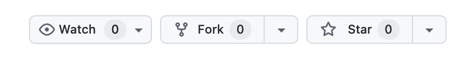
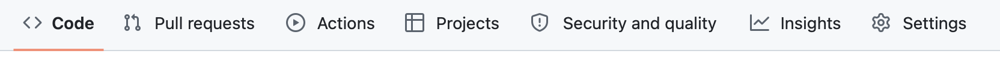

If you are an academic, you probably need a website. While it is a convenient way to manage your online presence, building one from scratch can be time-consuming (even with the help of an AI), and your time could likely be used more appropriately elsewhere. In this post, I will present a simple way to build a basic academic website that looks professional and should meet the needs of the vast majority of academics. There are many tutorials online explaining how to build an academic website (I myself used the excellent article by [Rob Williams](https://jayrobwilliams.com/posts/2020/06/academic-website/)to build my own in 2021), but in my opinion, the solutions proposed in these tutorials are often either too complex or too simple.

Even if you are willing to spend time building a complex site at the beginning, that complexity becomes a burden when trying to maintain it or keep it up to date. On the other hand, overly simple solutions may prevent you from adding custom features (with the help of an AI, for instance) later on. What I offer here is the most basic website possible: super easy to maintain, but built in a way that can be easily customised with the help of AI if and when the need arises.

# Thoughts
## Why you need an academic website ?

The purpose of this post is not to convince you of the usefulness of a website, yet in order to build the simplest site possible, it is important to identify the basic needs an academic website should fulfil. There is no need to argue that an online presence is almost essential nowadays. This presence can be obtained through social media, whether general (LinkedIn, Twitter, Bluesky) or academic-specific (ResearchGate, etc.), yet a personal website gives you more freedom and, importantly, helps you be more "findable" on Google. Here is a list of the minimal requirements an academic website should meet:

- Introduce yourself, your research, and perhaps your group.
- Display your work (publications, software packages, etc.).
- Help people get in touch with you.
- Display your CV.
- Make you discoverable on the internet.
- Connect all your social media in one place.

As a result, it seems to me that the simplest academic website should be composed of three main pages or sections:
- **Home**: Where you introduce yourself, your research, your group, your contact information, and your social media links.
- **CV**: Where your CV is available, preferably as the PDF version you likely already have.
- **Publications**: A list of your publications, with links to the full articles and any supplementary material, including code.

Depending on your specific situation, you may need other basic pages, perhaps a **Teaching** page to share information with your students, or a **Talks** page to display a list of presentations you have given. Such pages should be easy to add and maintain. Of course, you could imagine adding many sophisticated features, such as a calendar or a visitor map. We will not cover how to handle such advanced features in this post, but the basic website we will construct can easily be upgraded to accommodate them.

## Which solution to choose ? 

In order to get a website, two things need to happen: first, the website needs to be built, and then it needs to be hosted i.e., put somewhere on the internet where others can find it. There are multiple solutions for building and hosting a website. I will first exclude all paid options; while these are excellent and make sense for many professionals, they are generally unnecessary for a basic academic website.

Most universities provide free hosting solutions for their academics. While this might seem like a great option, it comes with several significant drawbacks. A primary advantage of having a webpage is to manage your long-term online presence; when someone types your name into Google, they should easily find all the necessary information about you. If you use a university-provided solution and subsequently move to a different institution or switch jobs, you risk losing that entire presence. While you could build a new site at your next university, all the links pointing to your former website and your hard-earned search engine ranking will be lost in the process.

If you are convinced of the need for an independent academic website, there are several popular options (such as WordPress, Wix, or Google Sites). However, the free versions of these tools often come with advertisements, forced branding, or unprofessional-looking URLs.

Instead, I propose using [GitHub Pages](https://docs.github.com/en/pages). It is a straightforward solution for building and hosting a professional website. It requires only minimal coding and a basic familiarity with GitHub—a tool with which most STEM academics will already be familiar. GitHub Pages is extremely popular for building academic websites and can be considered the current standard.


This is a great, practical guide. I have smoothed out the grammar, corrected several spelling errors (such as "repositorie" and "menue"), and improved the flow to make it feel more professional yet accessible.


# Setting Up Your Website

## GitHub

The first thing you need—and likely already have—is a [GitHub](https://github.com) account. Your website’s URL will be `http://<yourgithubusername>.github.io`. If you already have an account but are unhappy with your username, you can change it in your account settings.

Once your GitHub account is ready, you can fork this [repository](https://github.com/ValentinKil/academicwebsite). If you are not familiar with GitHub, think of this repository as a folder containing all the files that constitute your website; you are simply creating your own copy of this folder to customize. To fork the repository, log into your GitHub account and navigate to [this link](https://github.com/ValentinKil/academicwebsite). In the upper right corner of the window, you should see this:

<figure>
  
</figure>

Click the **"Fork"** button. A new page will open asking you to choose a repository name. You must enter `<yourgithubusername>.github.io`. Then, click **"Create fork."** Congratulations! You have just created your own copy of the academic website repository.

## Preparation to go online

In order to go online, you need to set up a few things in your repository. First, locate the top menu:

<figure>
  
</figure>

1. In your GitHub repository, click on the **"Actions"** tab in the top menu bar.
2. If you see a button that says **"I understand my workflows, go ahead and enable them,"** click it.
3. Click on **"Settings"** in the top menu of your repository.
4. On the left-hand sidebar, click on **"Pages."**
5. Under the **"Build and deployment"** section, ensure the **"Source"** is set to **"GitHub Actions."**


## Configuration 

Before launching your website, a few customizations are necessary. If you are comfortable with GitHub, you can clone the repository to your computer and update it using your favorite code editor. If you are new to GitHub, don't worry—everything can be done online! To modify a file directly on GitHub, click on **"Code."** in the top menue bar


From here, you can navigate your repository and locate the file you wish to modify. Once the file is open, click the pencil icon (**"Edit this file"**) on the right side to start making changes.

The first file to update is `_config.yml`:

* **Site Settings:** Update the `first_name` and `last_name` fields. Also, update the `url` to your actual website address: `http://<yourgithubusername>.github.io`. Below is an example using the name "Thomas Bayes":

```yaml
# -----------------------------------------------------------------------------
# Site settings
# -----------------------------------------------------------------------------

title: blank # the website title (if blank, full name will be used instead)
first_name: Thomas
middle_name:
last_name: Bayes
contact_note: ""
description: > # the ">" symbol means to ignore newlines until "footer_text:"
  A simple, whitespace theme for academics. Based on [*folio](https://github.com/bogoli/-folio) design.
footer_text: ""
keywords: jekyll, jekyll-theme, academic-website, portfolio-website # add your own keywords or leave empty
lang: en # the language of your site (for example: en, fr, cn, ru, etc.)
icon: 🎲 # the emoji used as the favicon (alternatively, provide image name in /assets/img/)

url: "http://thomasbayes.github.io"
baseurl: ""
last_updated: false # set to true if you want to display last updated in the footer
impressum_path: # set to path to include impressum link in the footer, use the same path as permalink in a page, helps to conform with EU GDPR
back_to_top: false # set to false to disable the back to top button
```

* **Jekyll Scholar:** Scroll down to the Jekyll Scholar section and update the `last_name` and `first_name` fields again.

```yaml
# -----------------------------------------------------------------------------
# Jekyll Scholar
# -----------------------------------------------------------------------------

scholar:
  last_name: [Bayes]
  first_name: [Thomas, T.]

  style: apa
  locale: en

  source: /_bibliography/
  bibliography: papers.bib
  bibliography_template: bib
  # Note: if you have latex math in your bibtex, the latex filter
  # preprocessing may conflict with MathJAX if the latter is enabled.
  # See https://github.com/alshedivat/al-folio/issues/357.
  bibtex_filters: [latex, smallcaps, superscript]

  replace_strings: true
  join_strings: true

  details_dir: bibliography
  details_link: Details
```

Once you have finished editing, click the **"Commit changes..."** button in the upper right corner. A pop-up will appear; click **"Commit changes"** again to save. At this point, your site is ready to go live! We will explain how to modify individual pages in the next section.


## Going Online

If you have followed all the steps described above, your website should be online after about a two-minute wait. If you click on **Actions**, everything should be green; if you return to the **Pages** section of the settings, you should see **"Your site is live at <yourgithubusername>.github.io."**

Every time you commit a change to your website, it should automatically be pushed online within a couple of minutes. If you do not see the changes, check that everything is green in the **Actions** menu. If the status is green but you still do not see any changes, it is likely because your browser has cached part of your website. Clear your cache, and your update should appear.


# Customise your website

## Customise the social media bar

Go to "_data>socials.yml", uncomment to social media you want to see appear in your bottom bar and add you username so it link directly to your account. 

## Add your profil picture 

Go to "assets>img" and replace "prof_pic.png" with your profile picture. Make sure the new picture is also in png format and is also named prof_pic.png. The size of the picture should not matter a lot, the current example is 1067 x 800 pixels

## Add you CV

Got to "assets>pdf" and replace "cv.pdf" with you CV. The CV can be as long as you which. 

## Customise your pages 

The main component of your website is of course the pages, in it's most basic version your website is made of 3 pages **About, Publication** and **CV**. We'll first explain how to customise this 3 pages and then we will discuss how you could add more pages. In general all your page are situated in "_pages" this is where you can modify and/or create your pages 

### About 

This page is the first to be displayed when we open you website. As every pages it is compose of header delimited by "---" and a body. We'll see more details about the header when we will explain how to create your own page but the **About** page is special as its header contain this "profil" section which govern the displayed of the profil picture with an email address underneath:

```markdown
---
//
profile:
  align: right
  image: prof_pic.png
  image_circular: false # crops the image to make it circular
  more_info: >
    <p><a href="mailto:name.surname@university.edu">name.surname@university.edu</a></p>
---
```

Here you can decide on which side of the window your profil picture will appear ('right'/'left'), if you which you can put image_circular at 'true' in order to get a circular profil picture, in which case I would advice to choose a square profile picture, and you can update you email address or just remove the whole more_info section if you don't want your email address under your profile picture. 

Under this header you can write anything to be displayed next to your profile picture. You should use a Markdown syntax, it's a very easy syntax, the proposed example already displayed most of the useful command but you can also read this [page](https://www.markdownguide.org/basic-syntax/) for more detail. 

### Publication

The publication page follow the same structure was an header and a body where you can write in Markdown. It's specificity is the line 

```markdown
<div class="publications">




</div>
```

This command will automatize the displayed of your publication !

To add publications create a new entry in the 'bibliography/papers.bib' file. You can find the BibTeX entry of a publication in Google Scholar ArXiv, or in the conference page itself. By default, the publications will be sorted by year and the most recent will be displayed first. You can change this behavior and more in the `Jekyll Scholar` section in '_config.yml' file.

### Buttons (through custom bibtex keywords)

There are several custom bibtex keywords that you can use to affect how the entries are displayed on the webpage:

- `abstract`: Adds an "Abs" button that expands a hidden text field when clicked to show the abstract text
- `arxiv`: Adds a link to the Arxiv website (Note: only add the arxiv identifier here - the link is generated automatically)
- `code`: Adds a "Code" button redirecting to the specified link
- `pdf`: Adds a "PDF" button redirecting to a specified file (if a full link is not specified, the file will be assumed to be placed in the /assets/pdf/ directory)
- `poster`: Adds a "Poster" button redirecting to a specified file (if a full link is not specified, the file will be assumed to be placed in the /assets/pdf/ directory)
- `slides`: Adds a "Slides" button redirecting to a specified file (if a full link is not specified, the file will be assumed to be placed in the /assets/pdf/ directory)
- `supp`: Adds a "Supp" button to a specified file (if a full link is not specified, the file will be assumed to be placed in the /assets/pdf/ directory)
- `website`: Adds a "Website" button redirecting to the specified link


### Author annotation

In publications, the author entry for yourself is identified by string array `scholar:last_name` and string array `scholar:first_name` in the `Jekyll Scholar` section in '_config.yml' file. For example, if you have the following entry in your `_config.yml`

```yaml
# -----------------------------------------------------------------------------
# Jekyll Scholar
# -----------------------------------------------------------------------------

scholar:
  last_name: [Bayes]
  first_name: [Thomas, B.]
```

If the entry matches one form of the last names and the first names, it will be underlined. 


If you wish to insert links to the webpage of your coauthor automatically, you can keep their meta-information in `_data/coauthors.yml`. The co-author data format is as follows, with the last names lower cased and without accents as the key:

```yaml
"price":
  - firstname: ["Richard", "R."]
    url: https://en.wikipedia.org/wiki/Richard_Price
```

If the entry matches one of the combinations of the last names and the first names, it will be highlighted and linked to the url provided. Note that the keys **MUST BE** lower cased and **MUST NOT** contain accents.


### CV

The CV page is very similar with the first 2, with an header and a body where you can write in markdown. The line 

```html
<iframe src="../assets/pdf/cv.pdf" width="100%" height="1200" frameborder="no" border="0" marginwidth="0" marginheight="0"></iframe>
```
displayed your CV on PDF format.


### Create your own pages 